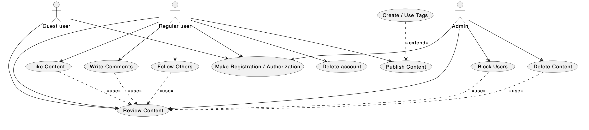

# Лабораторна робота №2 
**Предметна область:** *Соціальна мережа*  

## Use Case Diagram


## 1. Графічний варіант


---

## 2. Діаграма в PlantUML



## 3. Декларативний опис

```PlantUML
@startuml
actor "Guest user" as Guest
actor "Regular user" as User
actor "Admin" as Admin

usecase "Review Content" as RC
usecase "Like Content" as LC
usecase "Write Comments" as WC
usecase "Follow Others" as FO
usecase "Block Users" as BU
usecase "Delete Content" as DC
usecase "Publish Content" as PC
usecase "Create / Use Tags" as Tags
usecase "Make Registration / Authorization" as Auth
usecase "Delete account" as DA

Admin --> Auth
Guest --> Auth
Guest --> RC
User --> DA
User --> RC
Admin --> RC
User --> PC
User --> Auth
User --> FO
User --> LC
User --> WC
Admin --> BU
Admin --> DC
BU ..> RC : <<use>>
DC ..> RC : <<use>>
LC ..> RC : <<use>>
WC ..> RC : <<use>>
FO ..> RC : <<use>>

Tags ..> PC : <<extend>>

@enduml
```
## 4. UseCase + Functional/Nonfunctional req
UC1    Review Content    Перегляд контенту.
UC2    Like Content    Постановка лайку.
UC3    Write Comments    Написання коментаря.
UC4    Follow Others    Підписка на інших користувачів.
UC5    Block Users    Блокування користувачів (функція Admin).
UC6    Delete Content    Видалення контенту (функція Admin).
UC7    Publish Content    Публікація нового контенту.
UC8    Create / Use Tags    Створення та використання тегів.
UC9    Make Registration / Authorization    Реєстрація або вхід у систему.
UC10    Delete account    Видалення власного облікового запису.


