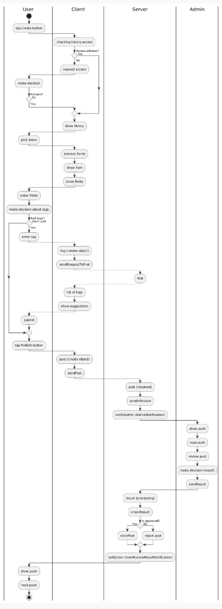

# Лабораторна робота №4
**Предметна область:** *Соціальна мережа*  


## 1. Activity diagram


## 2. BPMN


## 3. Діаграма в PlantUML



## 4. Декларативний опис

```PlantUML
@startuml
skinparam conditionStyle diamond

|User|
start
:tap create button;

|Client|
:checking library access;

if (Access allowed?) then (No)
    :request access;
    |User|
    :make decision;
    if (Allowed?) then (Yes)
        |Client|
    else (No)
        stop
    endif
else (Yes)
endif

|Client|
:show library;

|User|
:pick items;

|Client|
:process items;
:show item;
:show fields;

|User|
:enter fields;
:make decision about tags;

if (Add tags?) then (Yes)
    :enter tag;
    |Client|
    :tag (create object);
    :sendRequestToFind;
    |Server|
    :find;
    |Client|
    :list of tags;
    :show suggestions;
    |User|
    :submit;
else (Don't add)
endif

|User|
:tap Publish button;

|Client|
:post (create object);
:sendPost;

|Server|
:post (received);
:sendInReview;
:notifyAdmin (AdminNotification);

|Admin|
:show push;
:read push;
:review post;
:make decision (result);
:sendResult;

|Server|
:result (processing);
:checkResult;

if (Is approved?) then (Yes)
    :storePost;
else (No)
    :reject post;
endif

:notifyUser (UserReviewResultNotification);

|User|
:show push;
:read push;

stop
```
